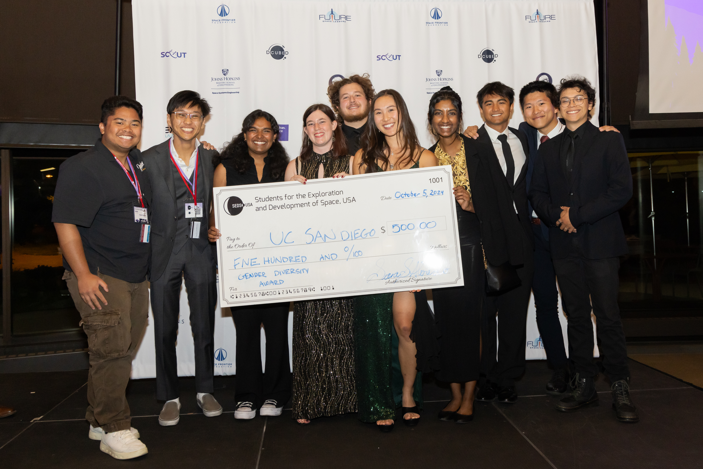
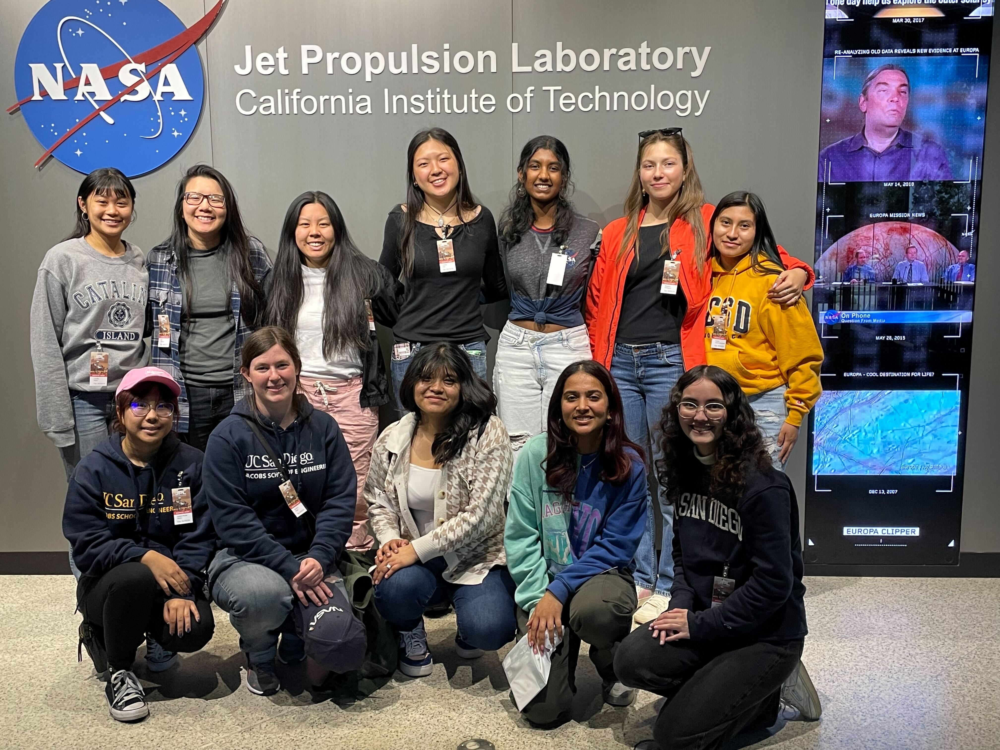

Aside from engineering, I have had the privilege of being able to teach and mentor my peers in engineering, academics, and specific coursework. Positions I have held are reflected here.

 

<h4>Director of Internal Affairs - SEDS UCSD</h4>

<i style="color:grey">May 2024 - June 2025</i>

In this role, I ran the Fall and Winter recruitment cycles for Students for the Exploration and Development of Space while an undergraduate at UCSD. During this time, we saw an increase in applicants and increased interactions across teams because of my early planning and marketing and efforts to encourage collaboration. I hosted 3 successful whole-org events with 70+ attendees and improved my skills in peer mediation.

 

<h4>MAE 180 Orbital Mechanics Course Assistant - UCSD</h4>

<i style="color:grey">Jan 2025 - March 2025</i>

In this course I served as a grader and hosted office hours for two hours a week to assist students with their homework and study methods for the course.

 

<h4>Female Engineering Mentorship (FEM) Program Co-Lead - SEDS UCSD</h4>

<i style="color:grey">March 2022 - July 2024</i>

In this role, I organized and recruited mentors from SEDS and UCSD's Formula SAE team Triton Racing (TR) for this joint mentorship program to encourage the retention of women in engineering by providing a mentor and support system of their peers.

Under my leadership there was a 200% increase in applicants and over 75% retention for 20+ mentees over 2 cohorts. I paired mentors and mentees based on compatability and had consistent one-on-one conversations with participants to identify needs. I composed and presented college, engineering, and professionalism workshops to prepare the mentees for their organization projects. I hosted a career panel with Northrop Grumman's women's ERG, NGWIN, and co-organized a tour of NASA JPL for both mentors and mentees.

From my work in this program, SEDS was awarded the Gender Diversity Award with a monetary prize at the 2024 Students for the Exploration and Development of Space SpaceVision national conference.

 

<h4>Summer Tutor/Mentor - TRIO UCSD</h4>

<i style="color:grey">June 2022 - July 2022</i>

I served as a Summer tutor for high schoolers participating in the Upward Bound program hosted by UCSD TRiO where they participated in 4 summer courses: Intro to Engineering, American Sign Language, English Language, and Intro to Python. I tutored a designated cohort for all courses and assisted the instructors during class.

During the Intro to Engineering course, I taught a segment on 3D modeling and led a design challenge activity where the students formed groups and created something to improve an ordinary item in their lives.

The students also attended a 3 day 2 night college tour where I was a chaparone and assisted Program Coordinators with tours and college readiness activities for students to do at the colleges.

 

<h4>AVID Tutor - Santana High School</h4>

<i style="color:grey">Aug 2021 - June 2022</i>

As an AVID tutor, I led tutoring groups during class hours for various subjects including AP Literature, AP US History, AP European History, and AP Gov as well being the designated tutor for the math subjects from Geometry to Calculus AB and Physics. For interested students, I helped them with college and scholarship applications. I created a template for a "cv" where they could list their achievements, involvements, and test scores to make it easier to populate applications and create a resume later on.

 

<h4>Personal Tutor</h4>

<i style="color:grey">Various</i>

I have been a personal tutor for middle school through college freshman levels as needed at various points in my college career. Most notably, I have tutored 8th grade home school supplemental learning and homework help and AP Physics C focusing on calculus review and how to connect it to physics.
